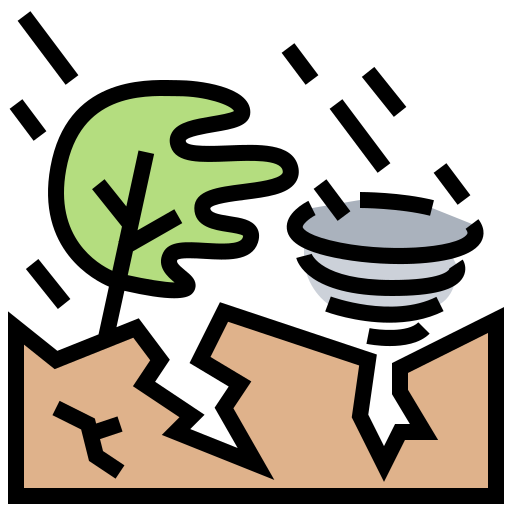

# Hazard datasets

**Hazard datasets** refer to a variety of datasets that can be used to represent the value that is exposed to suffer damage and losses from natural hazards. This section presents some of the most common and recent type of data and indicators used for this purpose. Please note that _CCDR focus only on hydro-meteorological hazards_, as geopyhisical hazards occurrence and intensity are not affected by climate change.

```{seealso}
Hazard datasets developed by WB disaster risk projects have been placed in a special collection of the WB Development Data Hub: [Risk Data Library Collection: **HAZARD**](https://datacatalog.worldbank.org/search?fq=(identification%2Fcollection_code%2Fany(col:col%20eq%20%27RDL%27))&q=hazard).
```

The most relevant datasets (updated, high resolution, scientific quality) representing extreme events and long-term hazards that were considered for inclusion in the CCDR and other risk-related activities across the Bank have been reviewed, explaining their pros and cons and providing suggestions for their use. Most datasets only cover the historical period (*baseline*); while a few of the hydro-met hazards also offer some *hazard projections*.

Some hazards are modelled using a **probabilistic approach**, providing a set of scenarios linked to hazard frequency for the period of reference. For the current data availability, this is the case for floods, storm surges, cyclones, heatwaves, and wildfires.
Others, such as landslides, use a **deterministic approach**, providing an individual map of hazard intensity or susceptibility.

```{table}
:name: hzd_datasets
:align: center
:width: 75%

| [**GEOPHYSICAL**](hzd_gp-data.md) | [**HYDRO-METEOROLOGICAL**](hzd_hm-data.md) | [**ENVIRONMENTAL**](hzd_env-data.md) |
| :---: | :---: | :---: |
| [Earthquake<br>](hzd_gp_eq)| [River floods<br>](hzd_hm_fl) | [Air pollution<br>](hzd_env_ap) |
| [Tsunami<br>](hzd_gp_ts) | [Landslide<br>](hzd_hm_ls) |   |
| [Volcanic activity<br>](hzd_gp_vo) | [Coastal flood<br>](hzd_hm_ss)  |  |
|   | [Tropical cyclones<br>](hzd_hm_tc) |   |
|   | [Drought<br>](hzd_hm_dr) |  |
|   | [Heat stress<br>](hzd_hm_hs) |  |
```