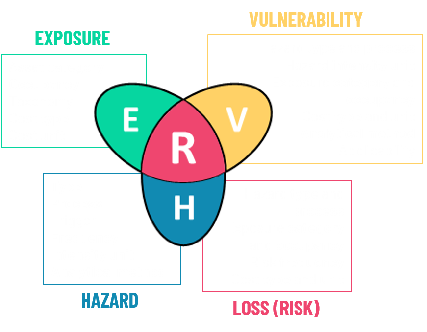

# Risk Data Library

Introduce [Risk Data Library](riskdatalibrary.org).

<div style="background-color:#0B3860;padding:25px;">

</div>

**Foundational Datasets** refer to **global, free to use risk datasets** that can be included in risk screening projects. Most of these datasets can be obtained through the WB Development Data Hub, being collected into the [Risk Data Library Collection](https://datacatalog.worldbank.org/int/search/collections/rdl).

```{note}
**World Bank Sharepoint** links are only accessible to WB team. For permissions to access these data, please write to the contact provided.

The **Development Data Hub** is the World Bank's central data catalogue and includes meta-data and license information.
```

In the next sections, some of the most recent global datasets that can fit a role as risk components are presented.