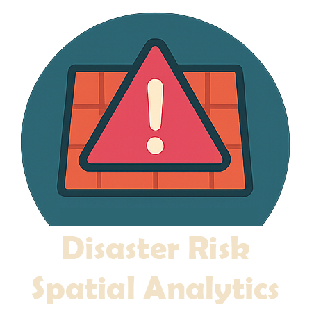
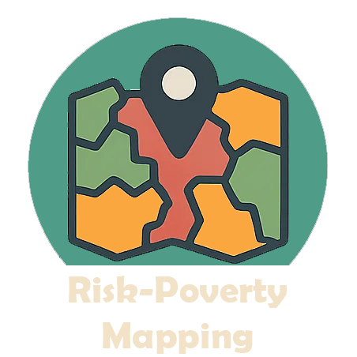
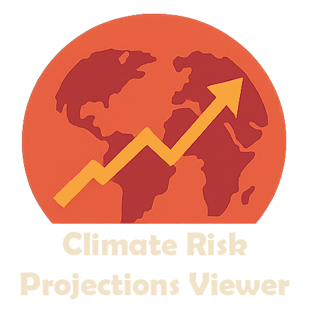
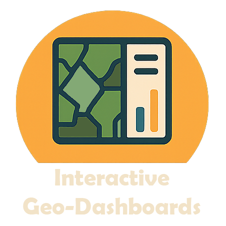

# Risk Data Library - Country Climate & Disaster Risk Screening Tools

<div class="news-container">
    <div class="news-ticker">
        <span class="news-item"><strong>UPDATE:</strong> Climate Indices Tool released for CMIP6 indicators! </span>
        <span class="news-item"><strong>UPDATE:</strong> STORM v4 tropical cyclone global model analysis notebook</span>
        <span class="news-item"><strong>ANNOUNCEMENT:</strong> New CCDR dashboard released for interactive exploration of risk </span>
    </div>
</div>

<style>
    .news-container {
        width: 100%;
        background-color: #f0f7fa;
        overflow: hidden;
        margin: 10px 0 20px 0;
        border-radius: 4px;
        border-left: 4px solid #118AB2;
    }
    .news-ticker {
        white-space: nowrap;
        padding: 10px 0;
        animation: ticker 30s linear infinite;
        color: #333;
        font-size: 14px;
    }
    @keyframes ticker {
        0% { transform: translateX(100%); }
        100% { transform: translateX(-100%); }
    }
    .news-item {
        display: inline-block;
        padding: 0 30px;
    }
    .news-item strong {
        color: #118AB2;
        font-weight: bold;
    }
    /* Pause animation on hover */
    .news-container:hover .news-ticker {
        animation-play-state: paused;
    }
</style>

This documentation offers guidance on risk screening and provides pythons tools to quickly produce natual hazards' risk screening at the national or sub-national level. The tools have originally being created for the World Bank's [**Country Climate and Development Report**](https://www.worldbank.org/en/publication/country-climate-development-reports) risk screening activities (2022/2025) and then furtherly developed within the [**Risk Data Library project**](docs/rdl.md).

## What you can do with these tools

<style>
.tools-grid {
  margin: 2rem 0;
}
.tool-item {
  display: flex;
  align-items: flex-start;
  margin-bottom: 2.5rem;
  gap: 1.5rem;
}
.tool-image {
  width: 250px;
  height: 250px;
  flex-shrink: 0;
  background-color: #064660;
  border-radius: 8px;
  box-shadow: 0 4px 8px rgba(0,0,0,0.1);
  transition: background-color 0.3s ease;
  display: flex;
  align-items: center;
  justify-content: center;
  padding: 10px;
}
.tool-image:hover {
  background-color: #fe5f86;
}
.tool-image img {
  width: 100%;
  height: 100%;
  object-fit: cover;
  border-radius: 8px;
}
.tool-content {
  flex: 1;
  padding-top: 0.5rem;
}
.tool-content h3 {
  margin: 0 0 0.5rem 0;
  font-size: 1.2rem;
}
.tool-content p {
  margin: 0;
  line-height: 1.6;
}
@media (max-width: 768px) {
  .tool-item {
    flex-direction: column;
    text-align: center;
  }
  .tool-image {
    width: 200px;
    height: 200px;
    margin: 0 auto;
  }
}
</style>


<div class="tools-grid">

<div class="tool-item">
<div class="tool-image">



</div>
<div class="tool-content">
<h3><strong>Analyze disaster risk</strong></h3>
<p>Perform <strong><a href="https://gfdrr.github.io/CCDR-tools/docs/intro-risk.html">spatial analytics of disaster risk</a></strong> using globally available datasets.</p>
</div>
</div>

<div class="tool-item">
<div class="tool-image">



</div>
<div class="tool-content">
<h3><strong>Map the interaction of risk and poverty</strong></h3>
<p>Combine hazard exposure and socio-economic vulnerability to produce <strong><a href="docs/risk-poverty.html">bi-variate maps</a></strong> highlighting risk-poverty hotspots.</p>
</div>
</div>

<div class="tool-item">
<div class="tool-image">



</div>
<div class="tool-content">
<h3><strong>Explore future climate risk</strong></h3>
<p>Generate climate risk outlooks based on <strong><a href="docs/climate-risk.html">CMIP6 climate projections</a></strong> and standardized risk indices.</p>
</div>
</div>

<div class="tool-item">
<div class="tool-image">



</div>
<div class="tool-content">
<h3><strong>Build interactive dashboards</strong></h3>
<p>Present results in an <strong><a href="docs/presentation.html#dashboard">interactive dashboard</a></strong> format to support communication, exploration, and stakeholder engagement.</p>
</div>
</div>

</div>


```{note}
Are you a World Bank TTL? You can request for availability to produce a new country screening using [**this form**](https://forms.office.com/r/UU3LXBNz4T).
```

## Applied globally
The map shows countries that have been already covered by the risk analytics. Click on the country name to download the risk screening report.

<iframe src="docs/maps/CCDR_map.html" height="500" width="100%"></iframe>

<!-- Table of CCDR Countries -->
| South & South-East Asia | Africa | Latin America & Caribbean | East Asia and Pacific |
|-------------------------|--------------------------------|------------------------|----------------------------|
| - Pakistan<br>- Nepal<br>- Bangladesh<br>- [**Cambodia**](https://github.com/GFDRR/CCDR-tools/blob/dev_push/reports/KHM_RSK.pdf)<br>- India<br>- Thailand<br>- Malaysia<br>- Philippines<br>- Mongolia | - Ghana<br>- Burkina Faso<br>- Mali<br>- Niger<br>- Chad<br>- Mauritania<br>- Guinea-Bissau<br>- Nigeria<br>- [**Senegal**](https://github.com/GFDRR/CCDR-tools/blob/dev_push/reports/SEN_RSK.pdf)<br>- Ethiopia | - Dominican Republic<br>- [**OECS countries**](https://github.com/GFDRR/CCDR-tools/blob/dev_push/reports/OECS_RSK.pdf)<br>&nbsp;&nbsp;- Antigua & Barbuda<br>&nbsp;&nbsp;- Dominica<br>&nbsp;&nbsp;- Saint Kitts & Nevis<br>&nbsp;&nbsp;- Saint Lucia<br>&nbsp;&nbsp;- Grenada<br>&nbsp;&nbsp;- Saint Vincent & Grenadines | - Fiji |

```{note}
This documentation reflects the approches and methods adopted for the CCDR disaster risk screening following the [**CCDR guidance note**](https://github.com/GFDRR/CCDR-tools/blob/main/docs/CCDR_notes/CCDR%20Tools%20and%20Approaches.pdf). They are based on the most typical DRM framework, yet there are many alternative approaches that could be adopted for similar purposes.
Also note that our tools are not expected to reflect all existing risk perspectives and dimensions, rather producing standardised risk indicators.
```
The CCDR risk screening tools has been developed in agreement with regional geography and poverty teams, and with the support of the World Bank Global Facility for Disaster Risk and Recovery ([**GFDRR**](https://www.gfdrr.org)).

```{figure} docs/images/GFDRR_logo.png
---
align: center
width: 70%
---
```

## Disaster risk framework

In the field of Disaster Risk Management (DRM), Risk (**R**) is typically calculated as a function of: the hazard occurrence probability and intensity (i.e., physical magnitude) in a particular location (**H**, for Hazard); the people and physical assets (infrastructure, buildings, crops, etc.) situated in that location and therefore exposed to the hazard (**E**, for Exposure); and the conditions determined by physical, social, and economic factors which increase the susceptibility of an exposed individual, community, asset or system to the impacts of hazards (**V**, for Vulnerability).

```{figure} docs/images/risk_framing.png
---
align: center
---
Conceptual framework of Disaster Risk as a combination of an hazard (described by intensity in relation to its occurrence frequency or probability) occurring in the same location of Exposed asset or capital (can include population, built-up asset, or else) which is vulnerable to suffer impact from that specific hazard.
```

```{seealso}
The **UN Global Assessment Report on Disaster Risk Reduction (GAR)** is the flagship report of the United Nations on worldwide efforts to reduce disaster risk. The GAR is published by the UN Office for Disaster Risk Reduction (UNDRR), and is the product of the contributions of nations, public and private disaster risk-related science and research, amongst others.

- **[UNDRR GAR 2022](https://www.undrr.org/global-assessment-report-disaster-risk-reduction-gar)**
```
